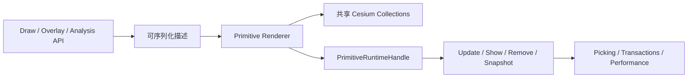

# M12：Primitive Renderer V2

本文定义 M12 的长期设计和验收边界。实现任务开始后，应另建 `.agents/docs/goals/m12-primitive-renderer-v2.goal.md` 记录执行合同和进度。

## Summary

M12 将现有以 polyline 为主的 Primitive 支持扩展为主要几何类型共享的运行时渲染器。Entity 继续作为兼容默认，高数量或长期存在的图形可以显式选择 SDK 管理的 Cesium Collection 和 Primitive。



## 为什么现在做

| 已有基础 | M12 的依赖关系 |
| --- | --- |
| M10 Scene transaction | Prepared Primitive runtime 可以参与 commit、rollback 和 identity 检查。 |
| M11 Mutation Leases | Collection mutation 与 Scene 恢复不会破坏共享索引。 |
| 数据快照 | Cesium runtime 与序列化描述已经分离。 |
| Picking / Selection | 新 Primitive 可接入统一 ownership 和高亮恢复。 |
| Performance | 可统计 renderer、runtime object 和 collection。 |

## M12-A：运行时基础

| 工作 | 结果 |
| --- | --- |
| Runtime handle | 建立内部 `PrimitiveRuntimeHandle`，统一 attach、detach、show、style、bounds 和 destroy。 |
| 几何覆盖 | 支持 point、billboard、label、polyline、polygon、wall、corridor。 |
| 共享所有权 | 安全复用 Cesium Collection，保留稳定 SDK id 和 object-to-owner 查询。 |
| 生命周期 | create/update/show/remove/clear/destroy 幂等且无泄漏。 |
| 并发 | 公开 renderer mutation 使用 M11 对应资源 lease。 |
| 序列化 | 只保存 descriptor 和应用数据，不保存 Cesium identity。 |

## M12-B：SDK 集成

| 集成 | 结果 |
| --- | --- |
| Draw / Overlay | 增加 opt-in Primitive 路径，不改变 Entity 默认和稳定 result id。 |
| Analysis | 只接入几何和清理语义已经稳定的结果。 |
| Picking / Selection | 共享 Collection 对象可解析回 SDK owner，并正确恢复高亮。 |
| Scene transaction | Detached prepare、原子 commit、rollback 恢复旧 runtime reference。 |
| Snapshot | 通过现有 Scene 选项 roundtrip 数据描述。 |
| Performance | 区分逻辑图形、runtime object 和共享 Collection，避免重复计数。 |

## 兼容规则

| 规则 | 决策 |
| --- | --- |
| 默认渲染器 | Entity 保持默认，调用方显式选择 Primitive。 |
| 公共结果 | id、positions、timestamps、style、properties 和 snapshot 字段保持稳定。 |
| Cesium API | 只使用公开 Collection、Geometry、Appearance、Material 和 Primitive API。 |
| Ownership | 即使共享 Collection，每个 runtime object 也只有一个 SDK owner。 |
| Material | 只持久化 descriptor，不持久化 Material、fabric runtime、callback 或 shader instance。 |
| 失败处理 | prepare/update 失败时旧 runtime 继续保持 attached 和可用。 |

## 验收条件

1. 七类 runtime 的 add/update/show/remove/clear/destroy 行为确定且幂等。
2. 重复 update/load/clear 后 Primitive 和 Collection 数量不累积。
3. Picking、Selection、`getRuntimeObjects()` 能解析共享 Collection ownership。
4. Snapshot 只含数据并恢复等价 renderer 状态。
5. Transaction rollback 恢复支持类型的旧 runtime object identity。
6. Scene recovery 与 renderer mutation 遵守 M11 lease 冲突规则。
7. Performance 正确区分逻辑图形、runtime object 和共享 Collection。
8. 单元、类型、构建和 Browser 验证无 console、shader、404 或 Cesium runtime 泄漏。

## 不在 M12

| 内容 | 后续位置 |
| --- | --- |
| Model 动画、部件、姿态、跟踪和路线 | M13。 |
| Camera 路线、漫游、第一人称和跟踪 | M14。 |
| Primitive/Effects/Operations/Model/Camera 产品面板 | M15。 |
| Worker 调度、GPU instancing 框架、自定义 shader 编辑器 | 有性能证据后单独立项。 |
| 全局替换 Entity | 不计划；Entity 保持兼容路径。 |
| 无关分析算法 | M16 或后续专项。 |

## 验证

```powershell
pnpm --filter @kairos3d/cesium typecheck
pnpm --filter @kairos3d/cesium test
pnpm --filter @kairos3d/cesium build
pnpm typecheck
pnpm test
pnpm lint
pnpm build
git diff --check
```

Browser 验证使用现有独立 fixture，完成后关闭临时页面和 Vite 服务。
