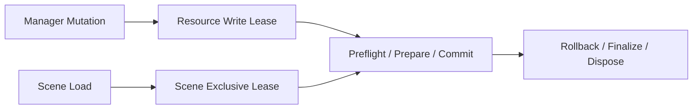

# 项目架构决策

本文记录维护者和 Agent 需要遵守的工作区边界、迁移策略和参考源码使用规则。SDK 用户可见的模块和运行语义位于 [`apps/docs`](../../apps/docs)。

## 工作区边界

```text
apps/docs
  面向 SDK 使用者的 VitePress 文档。

apps/examples
  使用 @kairos3d/cesium 的 React 示例应用。

packages/kairos3d-cesium
  无框架 SDK 源码、测试和构建配置。

packages/kairos3d-cesium-widget
  无框架 Widget Platform 核心。

packages/kairos3d-cesium-ui-react
  可选 React Provider、Shell 和标准 Widget。

.agents/docs
  项目状态、路线图、开发规则、里程碑设计和 Goal 合同。
```

## 核心原则

| 主题 | 决策 |
| --- | --- |
| 状态归属 | 所有 SDK 状态挂在 `KairosMap`，不注入 `window` 或 `viewer.mars`。 |
| Cesium 依赖 | `cesium` 保持 peer dependency，不打入 SDK bundle。 |
| UI 边界 | SDK Core 不依赖 React/Vue；产品 UI 位于可选包或应用层。 |
| Foundation-first | 共享生命周期、快照、并发和渲染基础优先于增加孤立功能。 |
| Public API | 优先使用当前 Cesium 公共 API，不依赖私有缓存、字段或原型修改。 |
| 快照 | 只保存 JSON-safe 描述，运行时对象由 manager 重建。 |
| 发布 | 发布、npm 和站点部署优先级低于 SDK 基础能力。 |

## 旧代码迁移规则

| 旧模式 | 当前规则 |
| --- | --- |
| `window.CityBaseX` / `viewer.mars` | 使用 `KairosMap` manager。 |
| 修改 Cesium prototype | 使用 wrapper、adapter 和 registry。 |
| DOM Draw Widget | 交互状态和临时 handle 由 Tool/Draw manager 管理。 |
| `Cesium.when` / `readyPromise` | 使用 `await` 和当前异步 factory。 |
| Viewer `imageryProvider` | 应用层优先使用 `baseLayer`。 |
| 硬编码 token | 通过应用配置注入。 |
| Cesium runtime 快照 | 保存 descriptor，恢复时重建。 |

## Scene 与并发决策



- Transactional 和 progressive Scene load 都持有 scene-wide exclusive lease。
- 普通 mutation 冲突时立即抛出 `RuntimeMutationConflictError`。
- Scene 默认等待已有 mutation，并通过 reservation 阻止后续普通写入造成饥饿。
- 取消后的 late Cesium work 清理完成前不释放 lease。
- Scene v1 只在真实不兼容持久化结构出现时升级。

## 参考源码策略

| 参考 | 用途 | 不复制内容 |
| --- | --- | --- |
| CityBase | 理解 Cesium engine 层改动。 | 不追求 engine fork 兼容。 |
| CityBaseX | 参考 Model、Effect、Tools 和 Widgets 能力。 | 不复制全局平台架构。 |
| Mars3D | 参考图层、绘制、分析和材质设计。 | 不保留全局对象、旧 Widget 约定或兼容 API。 |
| Holo3D | 参考功能组织和交互。 | 只作为设计输入。 |

算法可以按功能迁移，但必须按当前 Cesium 类型和公开 API 重写，并补生命周期、快照和测试。

## 文档边界

| 文档类型 | 位置 |
| --- | --- |
| 用户安装、API、公共运行语义 | `apps/docs` |
| 项目决策、状态、路线图、开发和发布流程 | `.agents/docs` |
| 项目入口 | 根 `README.md` |
| 包 API 入口 | `packages/*/README.md` |
| 公开变更历史 | 根 `CHANGELOG.md` |
