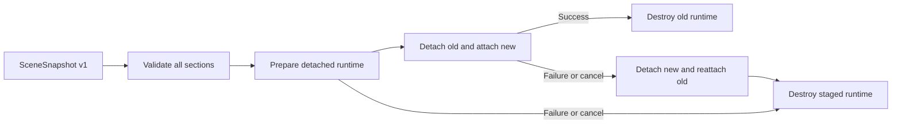

# Transactional Scene Recovery

Use this page when loading a complete `SceneSnapshot`, handling cancellation, or implementing a custom transactional layer adapter.

## Summary

| Decision | Contract |
| --- | --- |
| Snapshot schema | `SceneSnapshot.version` remains `1`; no migration API exists yet. |
| Default load mode | `transactional`. |
| Compatibility mode | `progressive` retains phase-by-phase M9 behavior. |
| Cancellation | The load promise rejects immediately; rollback may continue in the background. |
| Stable-state wait | `await map.sceneState.whenIdle()`. |
| Transaction scope | SDK-managed runtime with transaction staging support. |

## Common Path

```ts
import {
  isOperationCanceledError
} from "@kairos3d/cesium/operations";
import {
  parseSceneSnapshot,
  SceneTransactionError
} from "@kairos3d/cesium/scene";

const snapshot = parseSceneSnapshot(untrustedInput);
const controller = new AbortController();

const off = map.sceneState.on("transaction-change", (event) => {
  const state = event.data;
  console.log(state.status, state.stage, state.rollbackStatus);
});

try {
  await map.sceneState.load(snapshot, {
    mode: "transactional",
    clearLayers: true,
    restoreResults: true,
    clearResults: true,
    restorePrimitives: true,
    clearPrimitives: true,
    restoreOverlays: true,
    clearOverlays: true,
    restoreEffects: true,
    clearEffects: true,
    flyToCamera: true,
    signal: controller.signal,
    operationId: "restore-workspace"
  });
} catch (error) {
  if (isOperationCanceledError(error)) {
    await map.sceneState.whenIdle();
  } else if (error instanceof SceneTransactionError) {
    console.error(error.phase, error.stage, error.rollbackErrors);
  } else {
    throw error;
  }
} finally {
  off();
}
```

`mode: "transactional"` is shown explicitly for readability; omitting `mode` has the same behavior.

## Snapshot Validation

`parseSceneSnapshot(input)` performs data-only validation before scene mutation:

- requires `version === 1`;
- validates dates, finite camera values, section arrays, and unique non-empty layer/bookmark IDs;
- leaves section-specific semantic validation to the owning manager during transaction preparation;
- returns a deep clone and does not modify the input;
- does not read the Viewer or create Cesium runtime;
- preserves missing optional sections instead of adding empty arrays.

Memory/localStorage persistence adapters and Widget Platform Scene validation use the same Core parser. Invalid or unknown versions fail before any scene mutation.

There is no v1→v2 migration. The version should change only when an actual incompatible persisted schema requires it.

## Transaction Flow



| Phase | What changes in the Viewer |
| --- | --- |
| Validate | Nothing. The complete input is checked first. |
| Prepare | New SDK runtime is created but remains detached; manager indexes stay unchanged. |
| Commit | Old runtime is detached, new runtime is attached, and manager indexes switch. |
| Finalize | Old runtime is destroyed only after every commit stage succeeds. |
| Rollback | New runtime is detached, original runtime objects are reattached, then staged runtime is destroyed. |

The camera commits last. Commit start stops the active Tool and clears Selection; these transient interaction states are not part of rollback.

## Cancellation And Idle State

`map.operations.cancel(id)` or an external `AbortSignal` immediately changes the operation to `canceled` and rejects the original promise with `OperationCanceledError`.

Rollback is intentionally independent of that signal. This prevents a second cancellation from interrupting restoration halfway through.

```ts
try {
  await loadPromise;
} catch (error) {
  if (!isOperationCanceledError(error)) throw error;

  // The promise has rejected, but rollback can still be running.
  await map.sceneState.whenIdle();
  const state = map.sceneState.getTransactionState();
  console.log(state?.status, state?.rollbackStatus);
}
```

While a transaction or rollback is active:

- another `sceneState.load()` is rejected;
- `sceneState.toJSON()` is rejected to prevent saving an intermediate state;
- only one `scene.load` operation record exists;
- rollback progress is observed through `transaction-change`, not by mutating the finished operation record.

## Progressive Compatibility

Use progressive mode only when partial application is acceptable or a custom layer adapter has not implemented transaction hooks:

```ts
await map.sceneState.load(snapshot, {
  mode: "progressive",
  clearLayers: true
});
```

Progressive mode applies stages in order. Failure or cancellation stops later stages but does not restore already-applied stages. Direct `layers.load({ clear: true })` has the same limitation for previously cleared layers.

## Custom Layer Adapters

Transactional scene recovery requires detached lifecycle hooks:

```ts
interface LayerTransactionHooks {
  prepare(map: KairosMap): void | Promise<void>;
  attach(map: KairosMap): void | Promise<void>;
  detach(map: KairosMap): void | Promise<void>;
}

interface LayerAdapter {
  readonly transaction?: LayerTransactionHooks;
}
```

Default `xyz`, `wms`, `wmts`, `terrain`, `3dtiles`, `geojson`, and `gltf` adapters support this contract. A custom adapter without hooks fails transactional validation before scene mutation; its existing `addTo()` behavior remains usable through progressive mode.

`detach()` must remove runtime from Cesium collections without destroying it. `destroy()` must safely clean prepared, attached, or detached state.

## Boundaries

| Covered | Not covered |
| --- | --- |
| Supported SDK layers, bookmarks, results/clipping, primitives, overlays, effects, and camera. | Business-created Cesium objects outside SDK managers. |
| Original supported runtime object identity after successful rollback. | External side effects already performed by application event listeners. |
| Buffered SDK success events until transaction success. | Render-frame isolation or atomic GPU presentation. |
| Scene rollback before Widget Workspace restoration. | A platform-wide transaction spanning Scene and Widget Workspace. |
| Rollback diagnostics even when one handler fails. | Restoring active Tool, Selection, or an in-progress camera flight. |

## Related Docs

- [Operations And Loading](./operations.md)
- [Architecture](./architecture.md)
- [Roadmap](./roadmap.md)
